# 🏗️ Chat App Architecture & Flow Diagrams

## System Architecture

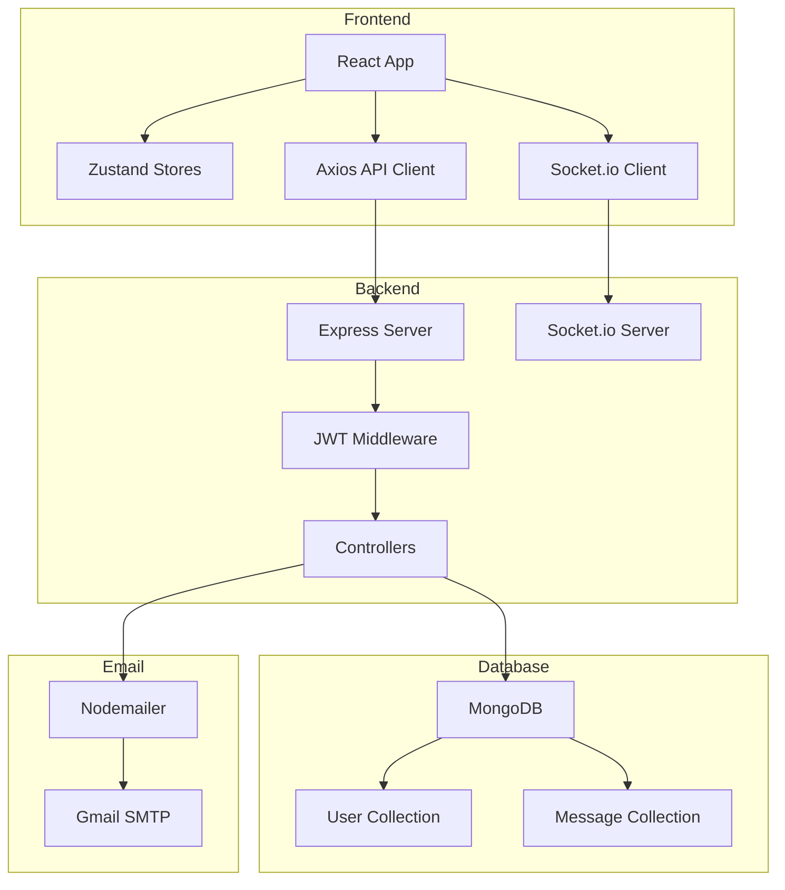

---

## Authentication Flow

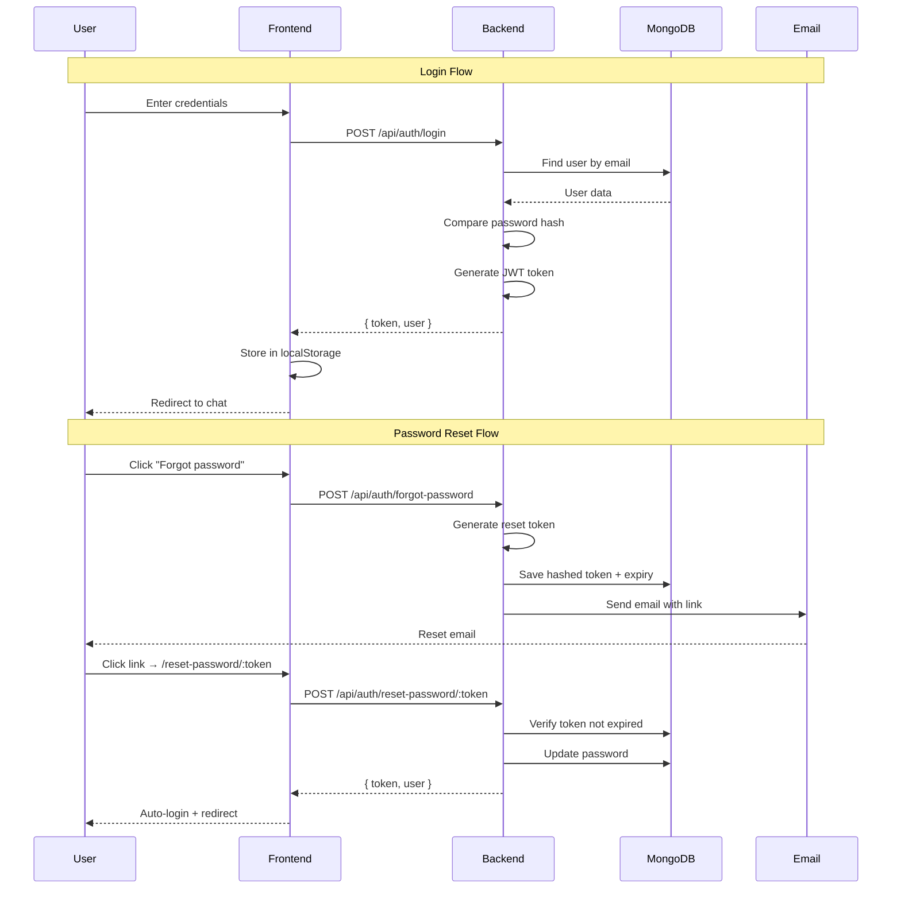

---

## Real-Time Messaging Flow

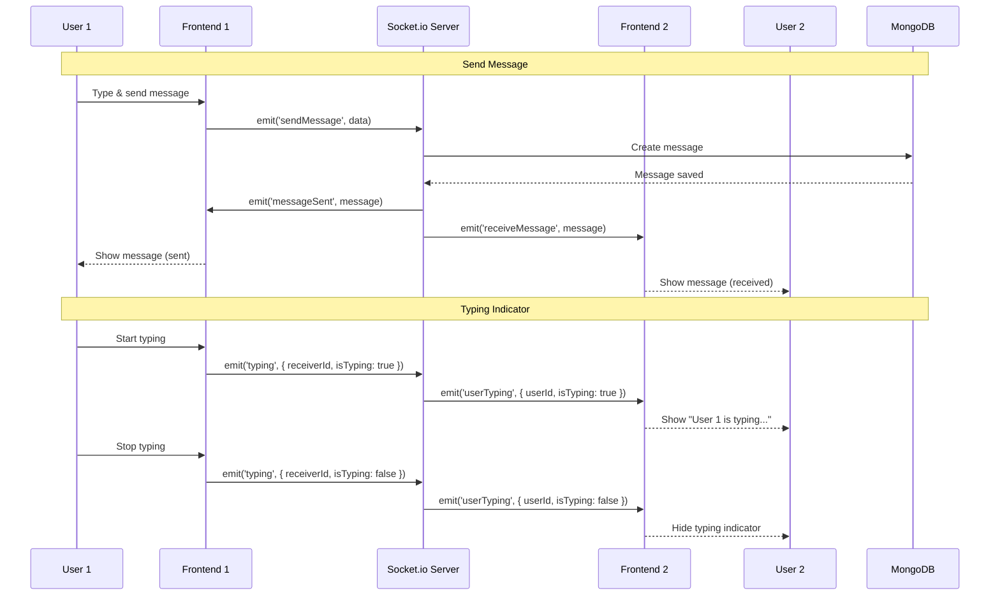

---

## Message Reactions Flow

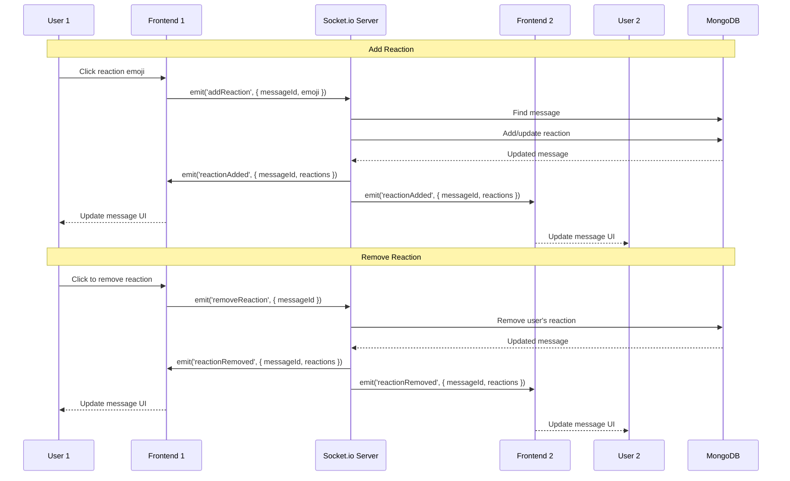

---

## Online/Offline Status Flow

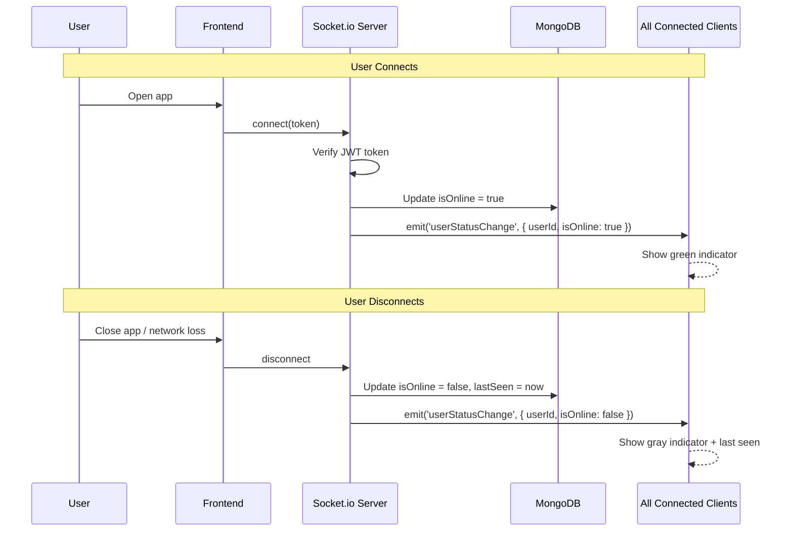

---

## Email Service Flow

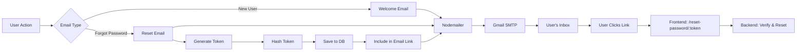

---

## Database Schema Relationships

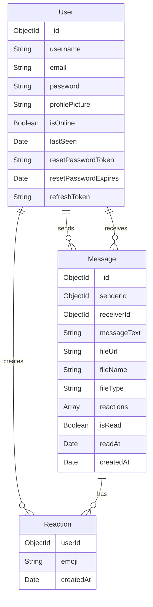

---

## Frontend Component Tree

```
App
├── App.css (Global Styles)
├── Routes
│   ├── / (Protected)
│   │   └── HomePage
│   │       ├── Sidebar
│   │       │   ├── User List
│   │       │   ├── Search
│   │       │   └── Profile Button
│   │       └── Chat Area
│   │           ├── Chat Header
│   │           ├── Messages
│   │           │   ├── Message Bubble
│   │           │   ├── Reactions
│   │           │   └── Timestamp
│   │           ├── Typing Indicator
│   │           └── Message Input
│   ├── /login
│   │   └── LoginPage (Animated)
│   ├── /signup
│   │   └── SignupPage (Animated)
│   ├── /forgot-password
│   │   └── ForgotPasswordPage
│   ├── /reset-password/:token
│   │   └── ResetPasswordPage
│   └── /profile
│       └── ProfilePage
└── Zustand Stores
    ├── authStore (user, token, login, logout)
    ├── chatStore (messages, users, selectedUser)
    └── socketStore (socket, connect, emit, listen)
```

---

## API Request Flow

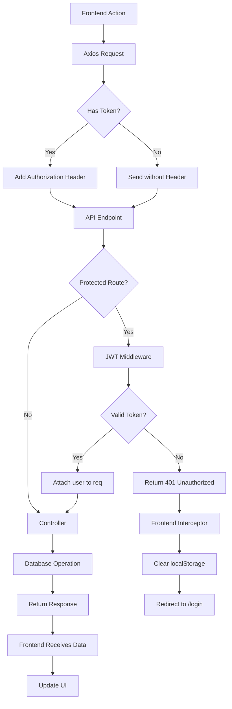

---

## Socket.io Event Flow

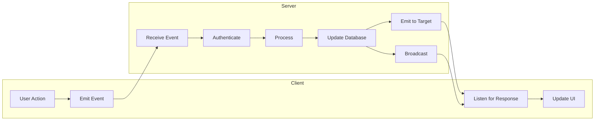

**Events Map:**
- `connection` → User connects
- `disconnect` → User disconnects
- `sendMessage` → Send chat message
- `receiveMessage` → Receive chat message
- `typing` → User typing status
- `userTyping` → Broadcast typing
- `markAsRead` → Mark messages read
- `messagesRead` → Notify sender
- `addReaction` → Add emoji reaction
- `reactionAdded` → Broadcast reaction
- `removeReaction` → Remove reaction
- `reactionRemoved` → Broadcast removal
- `userStatusChange` → Online/offline update
- `onlineUsers` → List of online users

---

## Security Flow

```mermaid
graph TB
    subgraph Password Reset Security
        A[User requests reset]
        B[Generate random token - crypto]
        C[Hash token - SHA256]
        D[Save hash to DB]
        E[Send plain token via email]
        F[User clicks link]
        G[Hash received token]
        H[Compare with DB hash]
        I{Match & Not Expired?}
        I -->|Yes| J[Allow password reset]
        I -->|No| K[Reject - Invalid/Expired]
    end
    
    subgraph JWT Security
        L[User logs in]
        M[Verify password - bcrypt]
        N[Generate JWT - jsonwebtoken]
        O[Sign with secret]
        P[Return to client]
        Q[Client stores token]
        R[Include in requests]
        S[Server verifies signature]
        T{Valid?}
        T -->|Yes| U[Grant access]
        T -->|No| V[Reject - 401]
    end
    
    A --> B
    B --> C
    C --> D
    D --> E
    E --> F
    F --> G
    G --> H
    H --> I
    
    L --> M
    M --> N
    N --> O
    O --> P
    P --> Q
    Q --> R
    R --> S
    S --> T
```

---

## Deployment Architecture

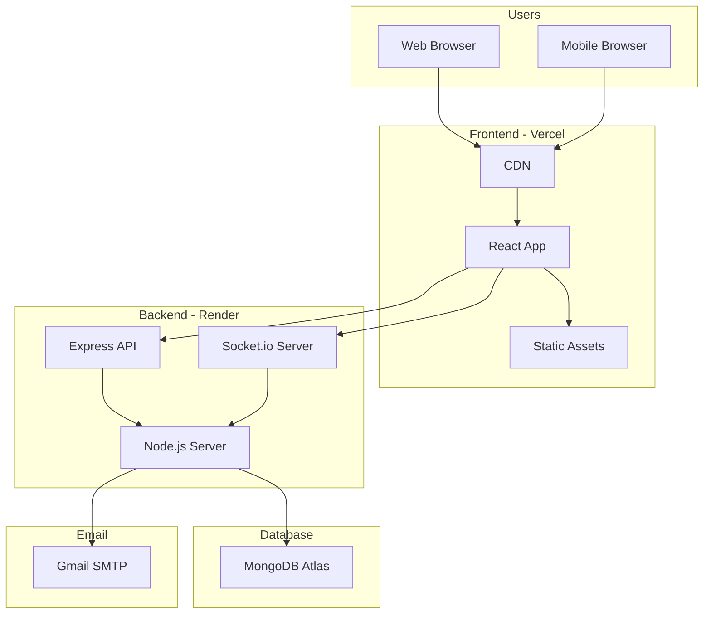

---

## Feature Dependencies

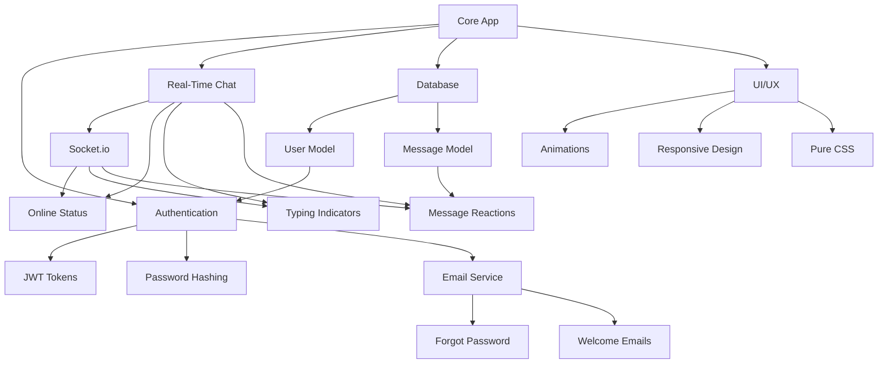

---

## State Management Flow

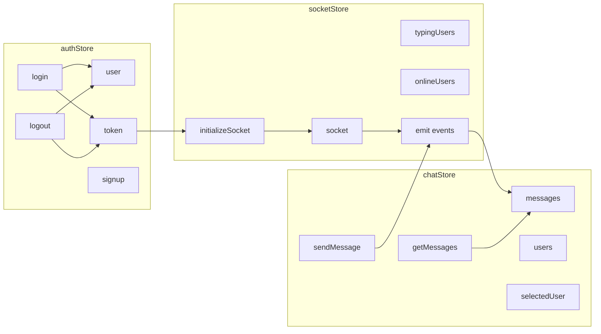

---

## Animation Timeline

```mermaid
gantt
    title Login Page Animation Sequence
    dateFormat X
    axisFormat %Ls
    
    section Background
    Gradient Shift     :0, 15000
    Float Particles    :0, 20000
    
    section Page Load
    Slide In Up        :0, 600
    Icon Pulse         :200, 2000
    Title Fade Down    :200, 800
    Subtitle Fade Down :300, 800
    Form Fade Up       :400, 800
    Footer Fade In     :600, 1000
    
    section Interactive
    Input Focus        :active, 0, 300
    Button Hover       :active, 0, 300
    Ripple Effect      :active, 0, 600
```

---

## Error Handling Flow

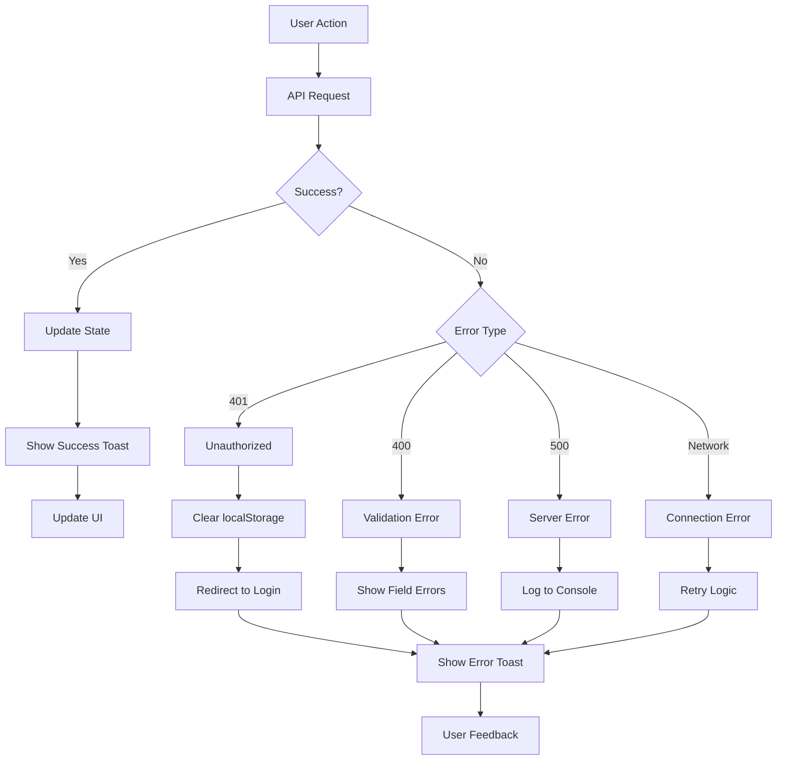

---

This architecture documentation provides a comprehensive visual overview of how all the features work together in the Chat App!
